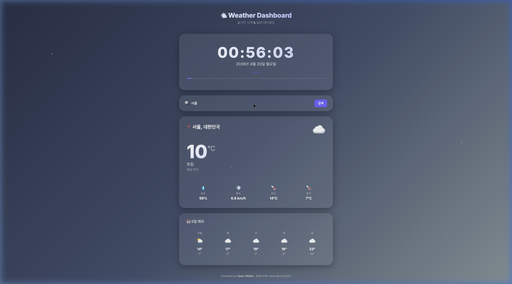
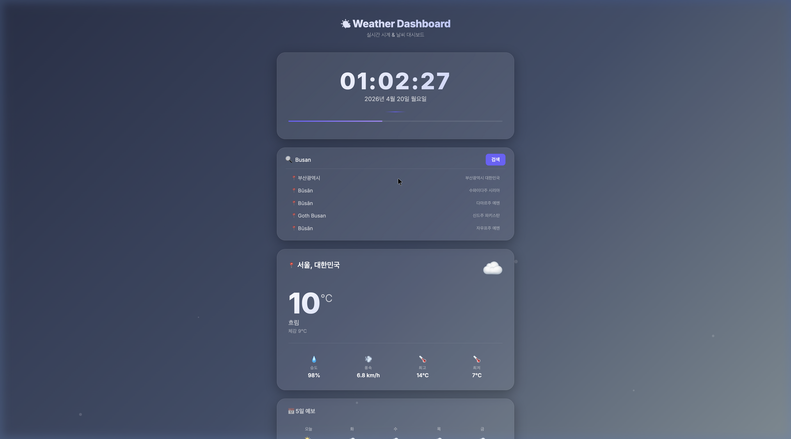

# 🌤️ 실시간 시계 & 날씨 대시보드

> Java Spring Boot + HTML/CSS/JavaScript로 만든 실시간 날씨 대시보드



## 📌 프로젝트 소개

이 프로젝트는 **실시간 시계**와 **전 세계 도시의 날씨 정보**를 한눈에 볼 수 있는 웹 대시보드입니다.  
Java 백엔드(Spring Boot)가 외부 날씨 API를 호출하고, 프론트엔드(HTML/CSS/JS)가 데이터를 시각적으로 표현합니다.

### ✨ 주요 기능

| 기능 | 설명 |
|------|------|
| ⏰ **실시간 디지털 시계** | 매초 업데이트 되는 시계 + 날짜 + 초 프로그레스 바 |
| 🌡️ **현재 날씨** | 온도, 체감온도, 습도, 풍속 한눈에 확인 |
| 🔍 **도시 검색** | 한글/영어로 전 세계 도시 검색 가능 |
| 📅 **5일 예보** | 앞으로 5일간의 최고/최저 온도 & 날씨 아이콘 |
| 🎨 **날씨별 배경** | 맑음·흐림·비·눈·뇌우 등에 따라 배경 그라데이션 자동 변경 |
| ✨ **파티클 애니메이션** | 배경에 떠다니는 빛 입자 효과 |
| 📱 **반응형 디자인** | 모바일/태블릿/데스크톱 모두 지원 |

---

## 🖼️ 스크린샷

### 메인 화면 (서울 날씨)
서울의 현재 날씨가 기본으로 표시됩니다.  
시계, 온도, 습도, 풍속, 최고/최저 온도, 5일 예보까지 한눈에 확인할 수 있습니다.


### 도시 검색
검색창에 도시 이름을 입력하면 전 세계에서 매칭되는 도시 목록이 드롭다운으로 나타납니다.



---

## 🛠️ 기술 스택

### Backend
| 기술 | 버전 | 역할 |
|------|------|------|
| **Java** | 25 (OpenJDK Temurin) | 서버 로직 |
| **Spring Boot** | 3.5.0 | 웹 프레임워크 |
| **Gradle** | 8.14.4 (Wrapper) | 빌드 도구 |

### Frontend
| 기술 | 역할 |
|------|------|
| **HTML5** | 페이지 구조 |
| **CSS3** | 글래스모피즘 UI, 애니메이션, 반응형 |
| **JavaScript (ES6+)** | 시계 로직, API 호출, DOM 조작 |
| **Google Fonts (Inter)** | 모던 타이포그래피 |

### 외부 API
| API | 설명 |
|-----|------|
| [Open-Meteo Forecast API](https://open-meteo.com/) | 현재 날씨 & 5일 예보 (무료, API 키 불필요) |
| [Open-Meteo Geocoding API](https://open-meteo.com/en/docs/geocoding-api) | 도시명 → 위도/경도 변환 |

---

## 📂 프로젝트 구조

```
weather-dashboard/
├── gradlew                       # Gradle Wrapper (빌드/실행 도구)
├── build.gradle                  # 의존성 & 빌드 설정
├── settings.gradle               # 프로젝트 설정
├── docs/
│   └── images/                   # 스크린샷
│       ├── dashboard_main.png
│       └── city_search.png
└── src/
    ├── main/
    │   ├── java/com/edward/weather_dashboard/
    │   │   ├── WeatherDashboardApplication.java   # 앱 시작점 (메인 클래스)
    │   │   └── controller/
    │   │       └── WeatherController.java         # 날씨 API 프록시 컨트롤러
    │   └── resources/
    │       ├── application.properties             # 서버 설정 (포트 등)
    │       └── static/                            # 정적 파일 (프론트엔드)
    │           ├── index.html                     # 메인 HTML 페이지
    │           ├── css/
    │           │   └── style.css                  # 스타일시트
    │           └── js/
    │               └── app.js                     # 클라이언트 로직
    └── test/
        └── java/com/edward/weather_dashboard/
            └── WeatherDashboardApplicationTests.java  # 테스트
```

---

## 🚀 실행 방법

### 사전 요구사항
- **Java 21 이상** 설치 (Java 25 권장)
- Maven/Gradle 설치 불필요 (Gradle Wrapper 포함)

### 실행

```bash
# 1. 프로젝트 디렉토리로 이동
cd weather-dashboard

# 2. 실행 (첫 실행 시 의존성 자동 다운로드)
./gradlew bootRun

# 3. 브라우저에서 접속
# → http://localhost:8080
```

### 빌드만 하기

```bash
# 빌드 (JAR 파일 생성)
./gradlew build

# 생성된 JAR 파일 직접 실행
java -jar build/libs/weather-dashboard-0.0.1-SNAPSHOT.jar
```

---

## 🏗️ 아키텍처

```
┌─────────────────┐     fetch()     ┌──────────────────┐    HttpClient    ┌─────────────────┐
│                 │  ──────────▶   │                  │  ──────────▶   │                 │
│   프론트엔드      │                │   Java 백엔드      │                │  Open-Meteo API  │
│   (HTML/CSS/JS) │  ◀──────────   │   (Spring Boot)   │  ◀──────────   │  (외부 날씨 API)   │
│                 │     JSON       │                  │     JSON       │                 │
└─────────────────┘                └──────────────────┘                └─────────────────┘
     브라우저                         localhost:8080                    api.open-meteo.com
```

### 왜 백엔드를 거칠까? (프록시 패턴)

프론트엔드(브라우저)에서 직접 외부 API를 호출하면 **CORS(Cross-Origin Resource Sharing)** 정책에 의해 차단될 수 있습니다.  
Java 백엔드가 중간에서 API를 대신 호출하는 **프록시** 역할을 하여 이 문제를 해결합니다.

---

## 📡 API 엔드포인트

이 프로젝트의 Java 백엔드가 제공하는 API입니다:

### 1. 현재 날씨 조회

```
GET /api/weather?lat={위도}&lon={경도}
```

**예시:**
```
GET /api/weather?lat=37.5665&lon=126.978
```

**응답 (JSON):**
```json
{
  "current": {
    "temperature_2m": 10.2,
    "relative_humidity_2m": 98,
    "weather_code": 3,
    "wind_speed_10m": 6.8,
    "apparent_temperature": 9.0
  },
  "daily": {
    "temperature_2m_max": [14, 17, 19, 19, 23],
    "temperature_2m_min": [7, 5, 7, 9, 10],
    "weather_code": [2, 3, 3, 3, 3]
  }
}
```

### 2. 도시 검색 (Geocoding)

```
GET /api/geocode?city={도시명}
```

**예시:**
```
GET /api/geocode?city=서울
```

**응답 (JSON):**
```json
{
  "results": [
    {
      "name": "서울",
      "latitude": 37.5665,
      "longitude": 126.978,
      "country": "대한민국",
      "admin1": "서울특별시"
    }
  ]
}
```

---

## 🌈 날씨 코드 & 아이콘 매핑

[WMO 날씨 코드](https://open-meteo.com/en/docs)를 이모지 아이콘과 한국어 설명으로 변환합니다:

| 코드 | 아이콘 | 설명 | 배경 테마 |
|------|--------|------|-----------|
| 0 | ☀️ | 맑음 | 보라색 밤하늘 |
| 1 | 🌤️ | 대체로 맑음 | 보라색 밤하늘 |
| 2 | ⛅ | 부분적으로 흐림 | 회색빛 하늘 |
| 3 | ☁️ | 흐림 | 회색빛 하늘 |
| 45, 48 | 🌫️ | 안개 | 안개 느낌 |
| 51~57 | 🌦️ | 이슬비 | 어두운 파랑 |
| 61~67 | 🌧️ | 비 | 어두운 파랑 |
| 71~77 | 🌨️❄️ | 눈 | 차가운 파랑 |
| 80~82 | 🌦️⛈️ | 소나기 | 어두운 파랑 |
| 95~99 | ⛈️ | 뇌우 | 어두운 남색 |

---

## 📚 이 프로젝트에서 배울 수 있는 것

| 카테고리 | 배우는 내용 |
|----------|------------|
| **Java** | HttpClient로 외부 API 호출, URL 인코딩, String.format() |
| **Spring Boot** | @RestController, @GetMapping, @RequestParam |
| **REST API** | GET 요청, 쿼리 파라미터, JSON 응답 설계 |
| **HTML** | 시맨틱 태그 (section, header, footer), 구조적 마크업 |
| **CSS** | 글래스모피즘, CSS 변수, Grid/Flexbox, 키프레임 애니메이션 |
| **JavaScript** | fetch API, async/await, setInterval, DOM 조작 |
| **설계 패턴** | 프록시 패턴 (CORS 우회) |

---

## 🔧 커스터마이징

### 기본 도시 변경
`js/app.js` 파일 맨 아래에서 기본 좌표를 변경할 수 있습니다:

```javascript
// 서울 대신 다른 도시로 변경
const defaultLat = 37.5665;   // ← 원하는 위도
const defaultLon = 126.9780;  // ← 원하는 경도
```

### 서버 포트 변경
`application.properties`에서 수정:

```properties
server.port=3000   # 8080 대신 3000번 포트 사용
```

### 배경 색상 변경
`js/app.js`의 `changeBackground()` 함수에서 그라데이션 색상 수정:

```javascript
const backgrounds = {
    clear:  ['#0f0c29', '#302b63', '#24243e'],  // ← 색상 변경
    rain:   ['#0f2027', '#203a43', '#2c5364'],
    // ...
};
```

---

## 📄 라이선스

이 프로젝트는 학습 목적으로 제작되었습니다.  
날씨 데이터는 [Open-Meteo](https://open-meteo.com/)에서 제공하며, 비상업적 용도로 무료 사용이 가능합니다.
